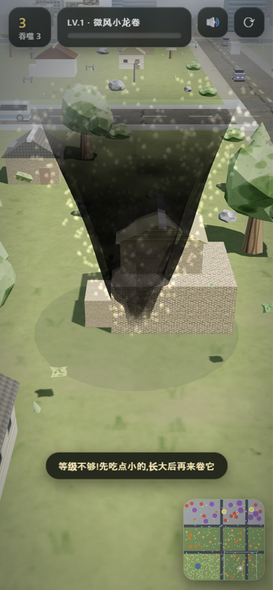
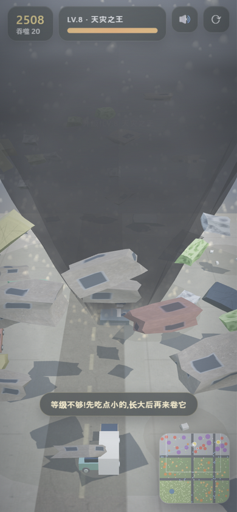
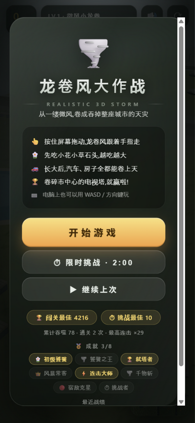
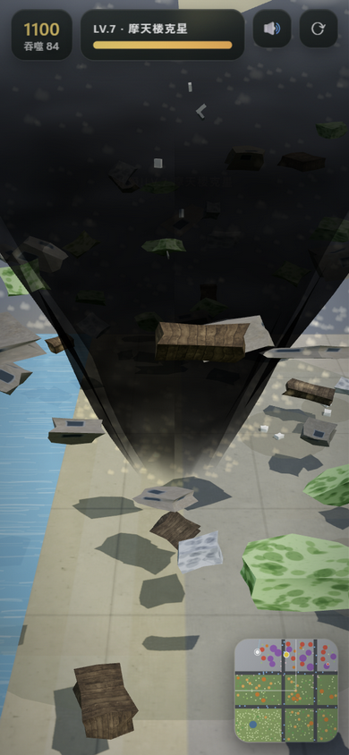
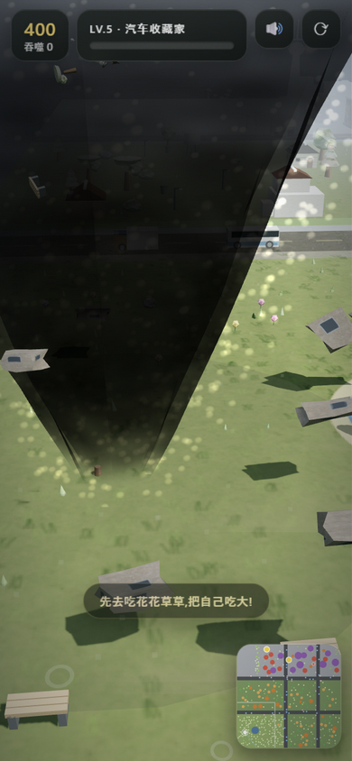

# 龙卷风大作战 3D 🌪️

一个"越吃越大"的 3D 手机网页游戏:你操控一缕小龙卷风,先吃花花草草,慢慢长大,
之后汽车、房子、甚至摩天大楼都能被你卷上天。卷碎市中心的**黄金电视塔**即通关!

基于开源 3D 引擎 [Three.js](https://github.com/mrdoob/three.js)(MIT 协议,已内置于
`index.html`,无需联网)。玩法致敬经典的《Tornado.io》/《块魂》(Katamari)。

## 文件说明

| 文件 | 说明 |
|---|---|
| `index.html` | **3D 主版本**(单文件,Three.js 已内联,直接打开即玩) |
| `classic.html` | 旧版 2D 俯视图(留作纪念,性能要求更低) |
| `three.min.js` | Three.js 引擎源文件(已内联进 index.html,仅为将来改动保留) |
| `_shell.html` / `_game3d.js` | 3D 版源码(改完用下面的命令重新构建) |
| `start-server.bat` | 一键启动局域网服务器,给手机访问用 |

改过 `_game3d.js` / `_shell.html` 后重新构建:

```bash
python build.py
```

构建器做的事不止两处替换:它把 `three.min.js`、`_game3d.js` 和 **15 张地面照片(base64 JPEG)** 一起内联进
`index.html`。自己手写 `replace('/*__THREE__*/', …)` 的那条命令会漏掉照片,产物里留着没填的
`__PHOTO` 占位符 —— 游戏能跑,但地面全是空的(实测这样构建出来 782KB,而 `build.py` 是 1.62MB)。

## 画面一览

| 郊区 | 满级风暴 | 主菜单 | 海滨 | 雪原 |
|---|---|---|---|---|
|  |  |  |  |  |

## 模式(菜单五选)

🌆 闯关(卷电视塔)/ ⏱ 限时 2:00 / 🌙 夜城 / ♾ 无尽(物件重生拼高分)/ ❄ 雪原

菜单上的「▶ 继续上次」不算一个模式 —— 它是上次那局闯关/夜城的存档入口,标签会跟着那一局的模式名变。

## 怎么玩

- **手机**:点一下想去的方向(抬手后龙卷风会继续走那一程,并停在你点的那一点),或按住屏幕拖动 —— 拖动期间风柱露在指尖上方,不被手指挡住
- **电脑**:鼠标拖动,或 WASD / 方向键
- 只能卷走等级 ≤ 自己等级的东西;卷不动的会在它身上画一圈,并提示"需要 LV.N,还差几级"
- 一共 8 个等级:微风小龙卷 → …… → 天灾之王;HUD 那行会写"下一级还差多少分"
- 被卷走的物件会真的螺旋升天、碎成零件绕着风柱飞舞,掉回地面的瓦砾留在原地
- 小地图是活的:吃掉的东西会从小地图上消失

## 在手机上玩(3 种方式)

1. **直接发文件**:把 `index.html` 单个文件(约 1.6MB,大头是 15 张地面照片)通过微信/QQ 发到手机,
   用浏览器(Chrome / Safari)打开即可,**无需联网**。
2. **局域网访问**:双击 `start-server.bat`,手机连同一个 WiFi,
   浏览器打开 `http://电脑IP:8000`。
3. **添加到主屏幕**:浏览器菜单里选"添加到主屏幕",像 App 一样全屏启动。

## 想打包成真正的 APK?(V1.0.0 已具备 PWA 条件)

本目录已包含 `manifest.json` 和 `icons/`(192/512 图标),满足 PWA 安装标准:

- **最简单**:用 [PWABuilder](https://www.pwabuilder.com) 输入游戏网址,
  直接生成安卓 APK / iOS 包,无需任何原生代码
- **Android 手机**:Chrome 打开 → 菜单"添加到主屏幕" → 获得全屏应用+桌面图标
- 也可以让我配置 Capacitor 打包工程(可加广告/内购等原生能力)

## 版本记录

**未发布(工作树,基于 V3.1.0)**
- 回路:暂停屏「重新开始」改成两步确认(改前实测一次点击就清掉本局存档,而它离「继续游戏」只有 59px);
  通关那一局不再出现在「▶ 继续上次」里;夜城存档续玩不再丢夜;菜单记住上次玩的模式
- 读得懂:HUD 多了「本局用时」与"下一级还差多少分";限时局内显示目标/上一局纪录;
  成就牌写"已 23/50"而不只是门槛;小地图改成活的(吃掉的会消失),上面"卷得动"的点
  从 1.4 CSS px 提到 3.9 px 且不再比"卷不动"的点更小(改前实测手机上是 60 个亮点全在 2px 以下,
  而拿不走的大楼有 5.1px —— 地图上最显眼的恰是不该去的地方);转屏(82↔116 px 窗格)后这些点会按新窗格重画,
  不再带着旧缩放退回亚像素;菜单两个「最佳」读数不再过期
  HUD「下一级解锁」那行缩成「解锁:」,并把分数段/标签/物件名钉成整块(`#nextlv .nb`),只留 `' · '` 那道缝可折:
  320px 手机上盒子只有 86px,原来会从词中间断开(「…下一 / 级解锁:大楼」),而带前导空格的整块钉死还会溢出被裁尾。
  提示通道不再"谁最后写谁赢":实测同一局里「🔒 电视塔在这个模式卷不动」会被后到的成就/警报顶掉,
  而这条解释只播一次(只有升级才重播) ⇒ 被顶掉一次就永远听不到第二遍。现在一次性解释有优先权,
  低优消息排一个有界队列(上限 3,溢出丢最旧)——成就提示不丢,也不会被谁刷成长队占满后面几秒。
- 够得着:矮屏(横屏手机、320×568)下结算/暂停/设置三张卡的行动与出口都在屏内;
  设置面板的常驻出口不再盖住别的按钮(改前横屏下有 10 个控件"看得见、点不到",含三条音量滑块之一);
  结算屏「📥 生成战报卡」现在真的能存走一张 PNG(改前浮层里只有「关闭」)
- 质感:斜贴在表面上的贴图统一开各向异性(`applyAniso()` → MAXANI=8)——实测立面一张 512² 铺 20~30m 而过滤还停在 1,
  斜视角被 mipmap 平均成一片糊;现在现场普查 33/33 张贴图都开了,产物只多约 170 字节(改的是运行时过滤参数,不加体积)。
  拆碎东西的反馈跟上体积:碎片数不再只看档位(`>=6?6:4`),改按半径算(实测 r=30/44/48/62/75 → 4/5/6/8/11 块);
  绕柱的碎块给了 6.5~10.5 秒寿命 —— 旧写法从不退场(实测 900 帧后仍有 76 块亮着),90 个槽位只增不减,
  填满之后"再拆东西就没有碎块"是静默发生的;碎块飞到顶也不再瞬移回脚下(改前单帧 |Δy| 最大 96,
  实测 65423 个同块相邻帧里有 2171 次瞬移 ⇒ 看着像柱底不断冒出新碎块)
- 不骗人:存档写不进去时(浏览器禁止保存 / 空间已满)暂停卡改口说"这一局没能存下",
  并说清「继续上次」会回到哪儿;改前同一块屏幕在局内 203 分、盘上只有 3 分时仍写「进度已存档」

**V3.1.0**
- iOS 安装引导:iOS Safari 首次访问显示"添加到主屏幕"操作条(一次性,
  12 秒自动消失或手动关闭),安卓仍走浏览器原生安装提示


**V3.0.9(bug 修复)**
- 修复:切后台标签页时风/雨/警报声持续播放(rAF 停后音频增益残留),
  现已随 visibilitychange 一并归零并保存进度


**V3.0.8**
- 战报卡"新纪录!"金色绶带(破纪录时分享图右上角斜角标)


**V3.0.7**
- 静音状态持久化:声音开关记忆在本地,刷新/重开不再自动恢复声音


**V3.0.6**
- 战报卡嵌废墟全景:分享图顶部为本局城市废墟实拍带(渐变压暗),
  分数与统计下移,战报更有冲击力


**V3.0.5**
- 首屏加载屏:6MB 下载期显示旋转龙卷风+"风暴生成中",告别白屏等待


**V3.0.4**
- 截图墙补齐:雪原定妆照入墙(郊区/风暴/菜单/海滨/雪原五格)


**V3.0.3**
- 滑雪者变体:5 个鲜艳滑雪人(双板+雪杖)高速滑行,发现龙卷风加速逃离(4 分)


**V3.0.2**
- 暴雪白茫:雪原模式风暴越强,白雾越浓越近(满级视距骤减,吞噬压迫感)


**V3.0.1**
- 雪原专属物件:8 个三球雪人(胡萝卜鼻/礼帽/树枝手)散布雪地,可卷走(3 分)


**V3.0.0**
- **❄️ 雪原模式**:全新雪城主题——地面覆雪/树挂雪冠/冷白雾/雪花缓落,
  无尽玩法拼分


**V2.6.4(V2.6 完结)**
- 收尾巡检:静态 12/12 + 动态回归(play/439 物件/涟漪池/零报错)全通过
- V2.6 交付:战报分享卡 / 雨滴涟漪 / 五档触感 / 结局废墟图


**V2.6.3**
- 结局废墟图:通关/限时结算背景实时叠加本局城市废墟高空全景
  (结算前抓拍,渐变蒙版压暗保证文字可读)


**V2.6.2**
- 触感分级:按吞噬物等级五档震动(花草微触→汽车轻震→大建筑重震→
  摩天楼三段连震→电视塔连震轰鸣),通关同塔级


**V2.6.1**
- 雨滴地面涟漪:暴雨时地面随机扩散圆环(池化 20 个,0.9s 生命周期扩散淡出)


**V2.6.0**
- 战绩分享卡:结算页「📥 生成战报卡」——Canvas 绘制战报(分数/等级/吞噬/用时/
  摧毁 TOP3/日期),弹出图片长按即可保存转发


**V2.5.5**
- 结局彩蛋:通关瞬间镜头广角冲击(FOV 55→69→回落)+ 全城窗灯齐闪 + 金白彩带连发


**V2.5.4**
- 闪电窗灯闪变:闪电劈下时全城窗灯瞬间增亮再缓落(夜景风暴氛围)


**V2.5.3**
- UI 动效:结算卡弹性入场动画;分数变化时 HUD 数字跳动放大反馈


**V2.5.2**
- 海鸥动画:7 只海鸥在海域上空盘旋(随机高度/半径/方向,扑翼摆动)


**V2.5.1**
- 海滨装饰:8 棵弯曲棕榈树(三段弯干+放射状扇叶+椰果)+ 10 把三色遮阳伞,
  均可被卷走(棕榈 6 分/伞 2 分)


**V2.5.0(三合一:夜/无尽/海滨)**
- **🌙 夜晚模式**:夜空着色/冷月光/深蓝雾,城市夜景一秒切换
- **♾ 无尽模式**:被吃物件在远离玩家处重生,城市永不枯竭,电视塔不可卷
- **海滨地图**:西北象限变为海(渐变水面+滚动波纹+沙滩带),市中心相应缩进


**V2.2.1**
- 办公楼基座挂真实瓷砖立面贴图(60% 随机,16 栋中 8 栋)


**V2.2.0(新目标 C:照片观感立面)**
- 办公楼窗绘制全面升级:双层窗框+十字窗棂+玻璃垂直渐变(天光→反射暗)
  +随机窗帘+楼板横带——程序窗达到照片观感(CC0 库无带窗立面照片,以精修绘制逼近)
- 新增 facade 瓷砖立面贴图(1024,备用基座材质)


**V2.1.0(精修收官:5-10 连发)**
- 玻璃反射 128→256px;行人摆臂动画;提示条防重入;
  帧率读数导出;PWA 图标高光;README 截图墙(3 张定妆照)


**V2.0.1(精修4)**
- 音效混音:全源接入总线压缩(-18dB/6:1 限幅,连吃不再爆音);
  四层配比重校(风 .22 封顶/碎裂 .12±随机/pop .09/木 .09/金属 .06)


**V2.0.0(贴图质量大版本)**
- 全部 15 张 Poly Haven 照片贴图升级 512/q68 → **1024px/q85**(砖/瓦/草/沥青/混凝土/灰泥/木板/法线全套)
- 启用各向异性过滤(渲染器最大值,斜视角不再模糊)
- 体积 1.5MB → 6.3MB(质量优先)


**V1.9.6(精修3)**
- 车漆质感:清漆高光泽(roughness .4→.22,环境反射 1.05)、
  银色轮毂盘(轮心金属盖)、红色自发光尾灯


**V1.9.5(精修2)**
- 树冠形体多样化:圆锥三层松树/卵形原木/平顶伞树三种冠型 + ±20% 尺寸抖动,打破克隆感


**V1.9.4(精修1)**
- 屋顶瓦密度修正(周期 5.8→20,真实陶瓦尺寸)+ 混凝土屋脊封边条


**V1.9.3**
- 地面草簇笔触:公园 2600 簇 + 郊区 1300 簇短弧草叶叠加,消除草地近景糊感


**V1.9.2(材质修复)**
- 砖墙/灰泥贴图密度修正(×2.3,砖块回到真实尺寸,消除拉伸色块)
- 色调校准:曝光 0.94/暖阳/环境光压暗,去灰白
- 程序白墙窗户加窗台投影+顶亮边,立体感增强


**V1.9.1**
- 小地图雷达扫描线(装饰动画,风暴追猎感)


**V1.9.0**
- **战绩历史**:记录最近 5 局(模式/得分/用时),主菜单展示


**V1.8.4**
- 成就墙显示进度表头「🏅 成就 n/8」,解锁情况一目了然


**V1.8.3**
- **结算摧毁统计**:通关/限时结算显示本局摧毁明细(前 4 类,如「摧毁:花×4 · 石块×2 · 长椅×1」)
- 补验:V1.8.1 烟纹风柱浏览器视觉复验通过(深色风柱烟气条纹清晰,零 GLSL 错误)


**V1.8.2**
- **成就第二波**:新增 🌪️千物斩(累计吞噬 1000)/🔴宿敌克星(反超对手 1 次)/
  ⏱挑战者(限时挑战 5 局),徽章墙共 8 枚
- **龙卷风皮肤纹理**(V1.8.1):漏斗表面叠加程序生成的流动烟气条纹

**V1.8.0**
- **残骸与对手存档化**:落地瓦砾与对手进度写入存档,续玩完整还原

**V1.7.1**
- **对手对抗行为**:红色 AI 30% 概率故意来玩家嘴边抢食,抢夺成功提示
  「对手抢走了你的猎物!」;对手分数领先 80+ 嘲讽「对手:就这?(狂笑)」,
  玩家反超时播报「反超了!保持压制!」
- 风柱进化曲线调优:LV1 更浅(尘卷风感),LV8 更黑(末日感)

**V1.7.0**
- **竞争 AI 龙卷风(上半)**:红色对手风暴自主觅食、等级/体积随得分成长,
  小地图红点 + 右上角对手分数 pill,不碰电视塔(通关权保留给玩家)

**V1.6.0**
- **风柱内部闪电弧**:LV6+ 电光在旋涡内部随机闪烁(锯齿线段+加色混合),
  与全屏闪电、暴雨、警报共同构成完整的风暴氛围

**V1.5.2**
- **双模式最佳分展示**:菜单同时显示 🏆 闯关最佳 与 ⏱ 挑战最佳 两枚徽章

**V1.5.1**
- **小地图动态点**:车辆(蓝点)与行人(粉点)实时位置上图

**V1.5.0**
- **限时挑战模式**:「⏱ 限时挑战 · 2:00」2 分钟计分赛,倒计时 HUD(末 10 秒
  红色脉冲),独立结算与挑战最佳分;与闯关模式并存

**V1.4.1**
- **龙卷风警报**:LV6 触发防空警报扫频声 + 全城紧急状态提示

**V1.4.0**
- **残骸落地物理**:碎片 40% 概率坠回地面成为永久瓦砾(上限 60 块)

**V1.3.1**
- **玻璃幕墙实时反射**:CubeCamera 探针(128px/每 20 帧)挂市中心第一玻璃塔
- GLB 模型试点经评估裁掉(单资产 5MB+ 超出单文件体积预算)

**V1.3.0**
- **成就徽章系统**:5 枚徽章 + 菜单徽章墙 + 持久化
- 存档续玩时天色/暴雨/闪电随恢复分数自动对应

**V1.2.2**
- **吞噬物理拖拽**:大建筑先摇晃松动约 0.8 秒再撕裂离地

**V1.2.1**
- 行为扩展:骑车逃亡(×2.6,3 分)与抱头蹲防(1 分)行人

**V1.2.0**
- **存档续玩**:种子随机城市 + 4 秒自动存档 + 「▶ 继续上次」

**V1.0.0 ~ V1.1.0**
- 基础版本:3D 城市、8 级成长、五类碎片池、照片材质、车流行人、
  风暴升级、罗盘、帧率自适应、精修 UI、PWA
